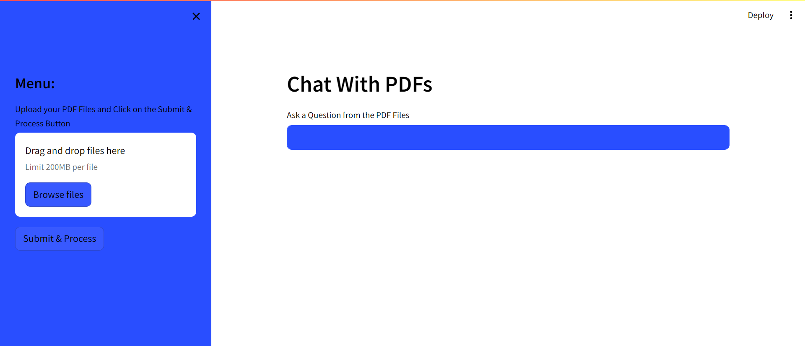
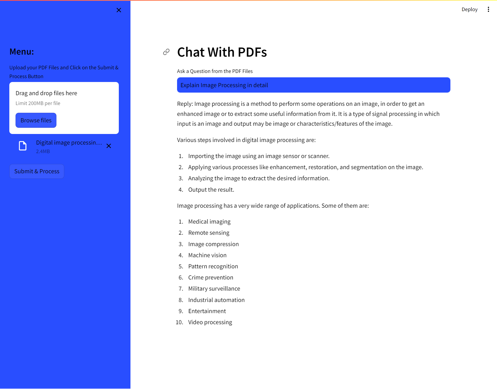

# Pdf-ChatBot

**Description:**

The PDF Chatbot is an AI-powered tool that allows users to upload multiple PDF files and then ask questions related to the content of these files. We have used LangChain and Google Gemini Pro Generative AI Model for the project.

<div align="center">

</div>
<div align="center">

</div>

**Features:**

1. **Upload PDFs:** Users can upload multiple PDF files to the chatbot.
2. **Ask Questions:** Users can ask questions related to the content of the uploaded PDFs.
3. **Search Content:** The chatbot searches for the relevant information in the PDFs and provides the user with the answer.
4. **Contextual Understanding:** The chatbot understands the context of the questions and provides accurate answers.
5. **Multi-Language Support:** The chatbot supports multiple languages for both input and output.
6. **Feedback System:** Users can provide feedback on the accuracy of the answers provided by the chatbot.

**Installation:**

1. Clone the repository:

    ```bash
    git clone https://github.com/rsharvesh16/Pdf-Chatbot.git
    ```

2. Go to the below link and you can create your own Gemini API key. Go to .env file and Upload your Google Gemini API Key.
   
    ```bash
    https://aistudio.google.com/app/apikey

    ```

3. Install the required dependencies:

    ```bash
    pip install -r requirements.txt
    ```

4. Run the application:

    ```bash
    streamlit run app.py
    ```

5. Access the chatbot interface by opening the following URL in a web browser:

    ```text
    http://localhost:8501
    ```

**Usage:**

1. Upload PDFs: Click on the "Upload PDF" button to upload one or more PDF files.
2. Ask Questions: Type your question in the input box and press "Enter" to get the answer.
3. Provide Feedback: Click on the "Feedback" button and provide feedback on the accuracy of the answers.
